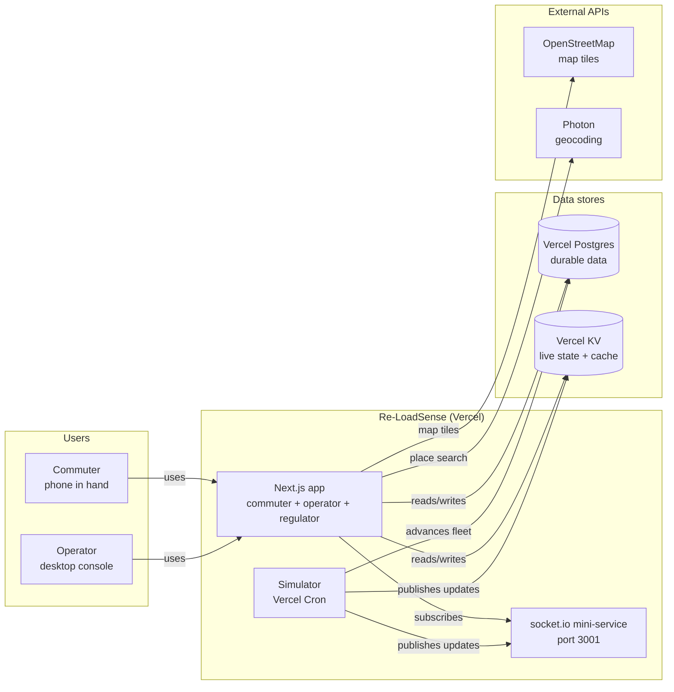
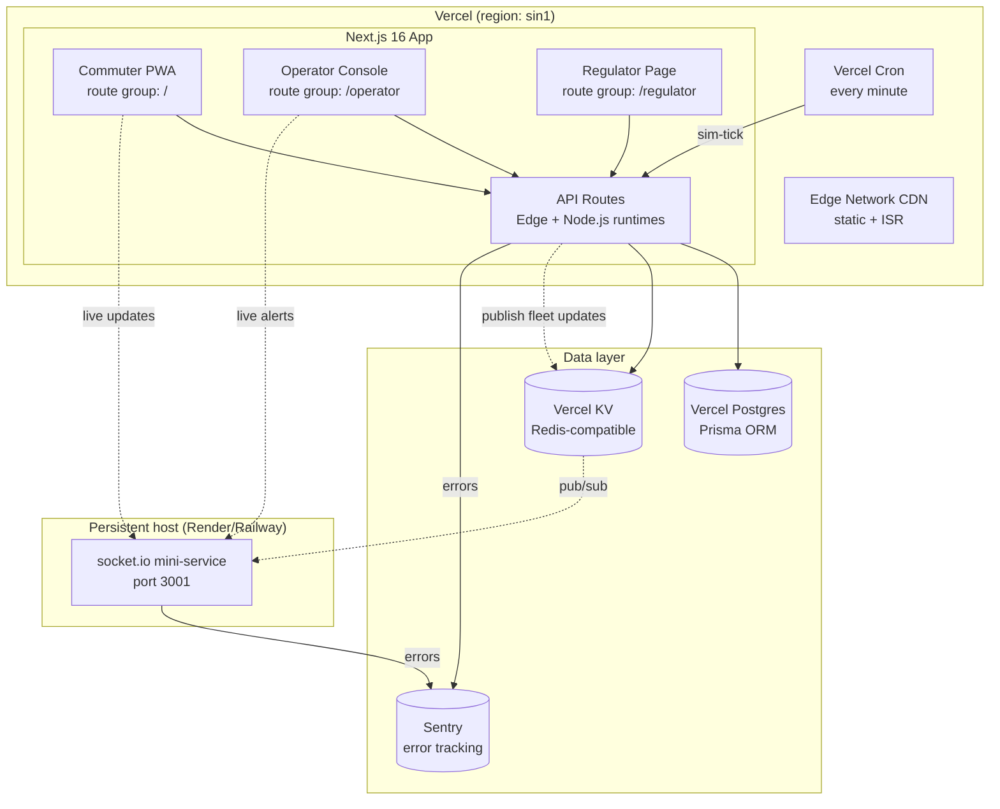
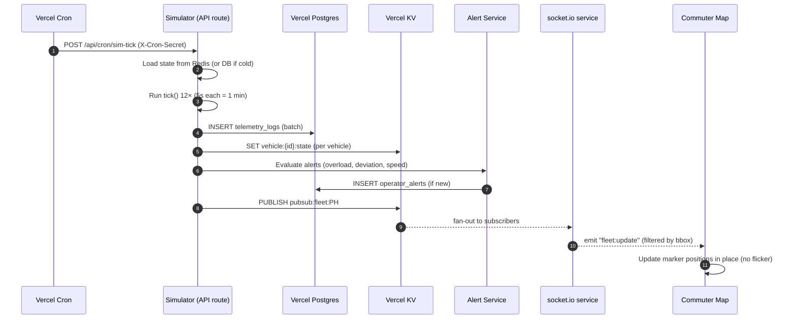
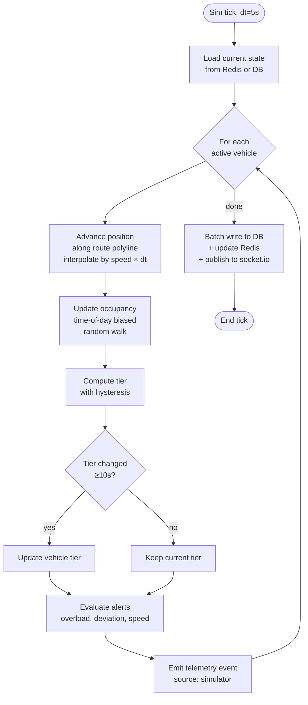
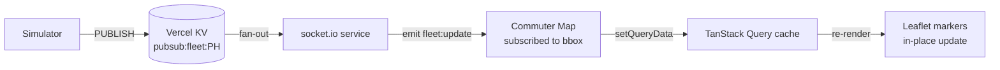
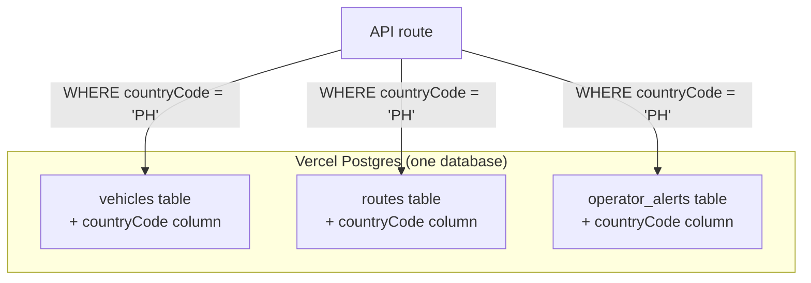

# 02 — Architecture

> How the system is structured. Same three-tier concept as the original (edge → cloud →
> clients), simplified for a solo Vercel build. Mermaid diagrams throughout.

---

## Table of contents

1. [System context](#1-system-context)
2. [Container view](#2-container-view)
3. [Request flow: edge telemetry to commuter map](#3-request-flow-edge-telemetry-to-commuter-map)
4. [The simulation engine](#4-the-simulation-engine)
5. [Real-time update flow](#5-real-time-update-flow)
6. [Multi-tenancy (simplified)](#6-multi-tenancy-simplified)
7. [Why this architecture (vs the original)](#7-why-this-architecture-vs-the-original)

---

## 1. System context

The platform has one job: turn PUV telemetry into useful information for commuters, operators,
and regulators. In this project, the "PUV telemetry" comes from an honest simulator (no real
hardware), but everything downstream is real.

### The three tiers (concept preserved, edge simulated)

| Tier | Original (hackathon) | This project |
|---|---|---|
| Edge | Real YOLOv8-nano on Raspberry Pi 5 + GPS + LED strip | **Honest sim** — seeded synthetic fleet, no hardware, labeled "SIM" |
| Cloud | FastAPI + 5 SQLite files + process-local singleton | **Next.js full-stack** + Vercel Postgres + Vercel KV + socket.io mini-service |
| Clients | Vanilla HTML/CSS/JS (3 pages) | **Next.js app** (3 route groups: commuter, operator, regulator) |

---

## 2. Container view

### Why a separate socket.io service?

Vercel serverless functions can't hold persistent WebSocket connections (they're short-lived
request handlers). So the socket.io service runs on a tiny persistent host (Render free tier,
Railway, or Fly.io — ~$5/month, or free on some tiers). The Next.js app connects to it via
the gateway `?XTransformPort=3001` mechanism.

**Fallback if budget is zero:** Skip the socket.io service entirely and use TanStack Query
polling (5s interval). The map still works, just less smooth. This is a defensible fallback
for a portfolio piece.

---

## 3. Request flow: edge telemetry to commuter map

This is the core data path. The simulator generates telemetry; the cloud ingests, enriches,
and stores it; the commuter map displays it in real time.

### Key design decisions in this flow

1. **State in Redis, durable in Postgres.** Live vehicle state (position, tier, occupancy) is
   in Redis for sub-millisecond reads. Every telemetry event is also appended to
   `telemetry_logs` in Postgres for history. This is the "hot read + durable append" pattern
   that the original got wrong (it used a process-local singleton that couldn't scale).

2. **Batch inserts.** The simulator writes 12 ticks worth of telemetry in one batch INSERT,
   not 12 separate inserts. Reduces DB load.

3. **Alert evaluation is synchronous but cheap.** On each tick, the alert service checks a
   few conditions (overload held >10s, deviation >200m, speed >80kph). Dedup: no duplicate
   open alerts for the same vehicle+type. This is O(vehicles) per tick — fast.

4. **Socket.io filtering by bounding box.** The commuter map subscribes to its visible area.
   The server only emits updates for vehicles in that area. (The original pushed everything to
   every client.)

5. **In-place marker updates.** The client receives a `fleet:update` event with the new
   position, and updates the existing marker's LatLng in place. No clear + re-add = no
   flicker. (The original flickered because it cleared all layers every refresh.)

---

## 4. The simulation engine

The simulator is the heart of the demo. It's a **pure function** with a **seeded RNG**, so the
same inputs always produce the same outputs (reproducible demos).

### What the simulator does per vehicle, per tick

1. **Advance position**: the vehicle moves along its route polyline. Distance = `speed × dt`.
   The polyline is an array of `{lat, lon}` points; the simulator interpolates between points
   by distance.
2. **Update occupancy**: a random walk biased by time-of-day. Rush hours (8am, 6pm) bias
   upward; off-peak biases downward. Bounded [0, capacity]. Seeded RNG for reproducibility.
3. **Compute tier**: map occupancy % to the 4-tier taxonomy. **Hysteresis**: a tier change
   must hold for ≥10s before it takes effect (prevents flicker).
4. **Evaluate alerts**: check overload (tier=overloaded for >10s), route deviation (>200m
   from route polyline via bounding-box), speed anomaly (>80kph). Dedup against open alerts.

### Why a pure function?

- **Reproducible demos.** Same seed → same fleet behavior. You can demo the same scenario
  every time.
- **Testable.** Unit tests verify: a vehicle 1km from a stop at 30kph → ETA ~120s. A vehicle
  at 100% capacity for 15s → overloaded tier + alert.
- **No side effects in the core.** Side effects (DB writes, Redis updates, socket publishes)
  happen in the cron route wrapper, not in the pure `tick()` function.

---

## 5. Real-time update flow

### The client connection

The commuter map connects to the socket.io service via `io("/?XTransformPort=3001")` (per the
gateway constraint — never `io("http://localhost:3001")`). On connect:

1. Client sends its visible bounding box.
2. Server assigns the client to the relevant tile rooms.
3. On fleet updates, the server emits only to clients in the relevant rooms.
4. Client receives `fleet:update` events, calls `queryClient.setQueryData` to update the
   TanStack Query cache, and the map markers update their positions in place.

### Reconnection

Auto-reconnect with exponential backoff (1s, 2s, 4s, 8s, max 30s). On reconnect, the client
re-subscribes to its current bounding box. While disconnected, TanStack Query falls back to
polling (5s interval) so the map still updates, just less smoothly.

---

## 6. Multi-tenancy (simplified)

The original had 5 SQLite files (one per country) with per-country fan-out — the main cause of
its slowness. This project uses **one database** with a `countryCode` column on tenant-scoped
tables.

For this project, there's only one country (`PH`), so the `countryCode` column is a
forward-looking design choice, not a functional necessity. But it means adding a second
country later is a data change, not an architecture change — unlike the original, which would
have needed a 6th SQLite file and code changes across every read/write.

---

## 7. Why this architecture (vs the original)

| Aspect | Original (hackathon) | This project | Why |
|---|---|---|---|
| Edge | Real YOLOv8 (claimed) but `webcam` mode was fake CV | Honest sim, labeled "SIM" | Integrity — no fake features |
| Backend framework | FastAPI + vanilla HTML | Next.js 16 full-stack | One codebase, one deploy, simpler for solo |
| Database | 5 SQLite files, per-country fan-out | 1 Vercel Postgres, `countryCode` column | Fixes the N+5 fan-out slowness |
| Live state | Process-local singleton (can't scale) | Redis (Vercel KV) | Shared state across workers |
| Real-time | Frontend polled 15-30s, no WS | socket.io live updates | Smooth map, no 15s jumps |
| Frontend | Vanilla HTML/CSS/JS, 3 pages | Next.js + Tailwind + shadcn/ui | Design system, type safety, responsive |
| Map | Vendored Leaflet, clear+re-add flicker | react-leaflet + clustering + in-place updates | Smooth, no flicker |
| Deploy | Docker Compose, manual | Vercel auto-deploy | Zero-config, fast hosting |

Every architectural choice traces back to fixing one of the seven problems. See
[`01-overview.md §4`](./01-overview.md#4-the-seven-problems-this-project-fixes) for the full
mapping.

---

## Next

- [`03-data-model.md`](./03-data-model.md) — the little things: every table, every field, how
  data is stored and fetched
- [`04-features.md`](./04-features.md) — what each feature does and the variables it needs
