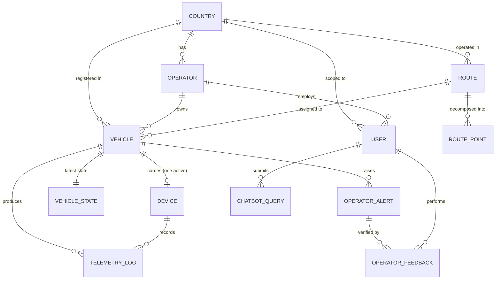

# 03 — Data Model

> **The little things.** Every table, every field, every type, every relationship, every index,
> how data is stored, and how it's fetched. This is planned before any code because changing
> the schema later means changing every file that touches it.

---

## Table of contents

1. [Design principles](#1-design-principles)
2. [Entity-relationship diagram](#2-entity-relationship-diagram)
3. [Tables (full field detail)](#3-tables-full-field-detail)
   - [3.1 `Country`](#31-country)
   - [3.2 `Operator`](#32-operator)
   - [3.3 `Route`](#33-route)
   - [3.4 `RoutePoint`](#34-routepoint)
   - [3.5 `Vehicle`](#35-vehicle)
   - [3.6 `Device`](#36-device)
   - [3.7 `TelemetryLog`](#37-telemetrylog)
   - [3.8 `VehicleState`](#38-vehiclestate)
   - [3.9 `OperatorAlert`](#39-operatoralert)
   - [3.10 `OperatorFeedback`](#310-operatorfeedback)
   - [3.11 `User`](#311-user)
   - [3.12 `ChatbotQuery`](#312-chatbotquery)
   - [3.13 `Place`](#313-place)
4. [Vehicle types and the route-vehicle type constraint](#4-vehicle-types-and-the-route-vehicle-type-constraint)
5. [Redis key patterns](#5-redis-key-patterns)
6. [How data is fetched (query patterns)](#6-how-data-is-fetched-query-patterns)
7. [Prisma schema](#7-prisma-schema)
8. [Seed data](#8-seed-data)
9. [Why these fields (tracing to the original's mistakes)](#9-why-these-fields-tracing-to-the-originals-mistakes)

---

## 1. Design principles

1. **One database, not file-per-country.** The original used 5 SQLite files and fanned out
   queries across all 5 — the main cause of its slowness. This project uses one Vercel
   Postgres with a `countryCode` column. See [`02-architecture.md §6`](./02-architecture.md#6-multi-tenancy-simplified).

2. **Every field has a type, a constraint, and a reason.** No bare `float` for latitude (it
   must be bounded -90 to 90). No bare `string` for a vehicle ID (it must have a pattern). No
   bare `int` for occupancy (it must be ≥0). This prevents the "calculations were wrong"
   problem at the schema level.

3. **No denormalized data that can drift.** The original stored route polylines as both a JSON
   blob AND as `route_points` rows — they could drift out of sync. This project stores
   geometry once (in `RoutePoint` rows) and derives polylines on demand.

4. **Indexes on the columns queries actually use.** Not "the obvious columns" — the columns
   the real queries filter on. Each index below is justified by a query pattern in §5.

5. **Hot reads from Redis, durable writes to Postgres.** Live vehicle state is in Redis
   (sub-millisecond reads). Every telemetry event is appended to `TelemetryLog` (history).
   This is the "hot read + durable append" pattern.

6. **Forward-looking but minimal.** A `countryCode` column even though there's only PH — so
   adding a second country later is a data change, not an architecture change. But no RLS,
   no partitioning, no audit log — those are production scope, not portfolio scope.

---

## 2. Entity-relationship diagram



---

## 3. Tables (full field detail)

### 3.1 `Country`

**Purpose:** One row per country. Forward-looking (only PH in this project, but the schema
supports more).

| Field | Type | Constraints | Why |
|---|---|---|---|
| `code` | `String` | PK, 2 chars, uppercase | ISO 3166-1 alpha-2 (e.g., "PH") |
| `name` | `String` | not null | Display name (e.g., "Philippines") |
| `currency` | `String` | 3 chars, default "PHP" | ISO 4217 (for fare display) |
| `defaultLanguage` | `String` | default "en" | UI language hint |
| `createdAt` | `DateTime` | default now() | Audit |

**Indexes:** PK on `code`.

**Rows in seed:** 1 (`PH`, Philippines, PHP, en).

---

### 3.2 `Operator`

**Purpose:** A PUV operator (a company/cooperative that owns vehicles). In this project, one
operator owns all 15 simulated vehicles.

| Field | Type | Constraints | Why |
|---|---|---|---|
| `id` | `String` | PK, cuid | Stable ID |
| `name` | `String` | not null, max 100 | Display name (e.g., "Cebu Transport Co.") |
| `countryCode` | `String` | FK → Country.code, not null | Tenancy scoping |
| `licenseNo` | `String` | not null, max 50 | LTFRB license number |
| `status` | `Enum` | `active \| suspended`, default `active` | Can be suspended |
| `createdAt` | `DateTime` | default now() | Audit |
| `updatedAt` | `DateTime` | updatedAt | Audit |

**Indexes:** PK on `id`; index on `countryCode`.

**Rows in seed:** 1 (Cebu Transport Co., PH, active).

---

### 3.3 `Route`

**Purpose:** A PUV route (e.g., Cebu jeepney route "04L"). This is one of the most important
tables — the original had route data scattered across JSON files, DB rows, and config with
denormalized polylines that could drift. This project stores a route cleanly.

| Field | Type | Constraints | Why |
|---|---|---|---|
| `id` | `String` | PK, cuid | Stable ID |
| `code` | `String` | not null, max 20, pattern `^[0-9A-Z]+$` | Route code (e.g., "04L", "17C") — what commuters see |
| `name` | `String` | not null, max 200 | Full name (e.g., "04L - Lahug to SM City") |
| `tag` | `String` | max 20, nullable, unique per country | Short tag (e.g., "04L", "CIBUS", "MYBUS") — for search + chatbot matching |
| `countryCode` | `String` | FK → Country.code, not null | Tenancy scoping |
| `region` | `String` | max 100, nullable | Area (e.g., "Cebu City") for filtering |
| `originName` | `String` | max 100, nullable | Origin point name (e.g., "Lahug") — for display + search |
| `destinationName` | `String` | max 100, nullable | Destination point name (e.g., "SM City") — for display + search |
| `distanceKm` | `Float` | ≥ 0, nullable | Computed from polyline; nullable until calculated |
| `capacity` | `Int` | ≥ 1, default 20 | Standard vehicle capacity for this route |
| `allowedVehicleTypes` | `String[]` | not null, ≥ 1 element | Which PUV types can serve this route (e.g., `["jeepney", "minibus"]`). See §4. |
| `routeType` | `Enum` | `linear \| loop`, default `linear` | **How the route is traversed.** `linear` = goes A→B then turns around B→A (most jeepney routes). `loop` = goes A→B→C→...→A (circular routes). See §4.2. |
| `minFare` | `Float` | ≥ 0, default 13.0 | Minimum fare (PHP) |
| `farePerKm` | `Float` | ≥ 0, default 2.25 | Per-km fare (PHP) |
| `status` | `Enum` | `active \| inactive`, default `active` | Soft delete |
| `createdAt` | `DateTime` | default now() | Audit |
| `updatedAt` | `DateTime` | updatedAt | Audit |

**Indexes:** PK on `id`; **unique** on `(code, countryCode)` (no duplicate route codes within
a country); index on `countryCode`; index on `region`.

**Unique constraint:** `@@unique([code, countryCode])` — two routes in the same country can't
share a code. This prevents the data confusion the original had.

**How geometry is stored:** The route's polyline (the path the vehicle follows) is NOT stored
as a JSON blob in this table. It's stored as ordered `RoutePoint` rows (see 3.4). The route
table holds metadata only. This eliminates the drift risk the original had.

**How it's fetched:** See §5.1.

---

### 3.4 `RoutePoint`

**Purpose:** An ordered point on a route's polyline. The route geometry is the ordered set of
these points. This is the **single source of truth** for route geometry — no denormalized JSON
blob.

| Field | Type | Constraints | Why |
|---|---|---|---|
| `id` | `String` | PK, cuid | Stable ID |
| `routeId` | `String` | FK → Route.id, not null, onDelete: Cascade | Parent route |
| `seq` | `Int` | ≥ 0, not null | Order in the polyline (0, 1, 2, ...) |
| `lat` | `Float` | ≥ -90, ≤ 90, not null | Latitude |
| `lon` | `Float` | ≥ -180, ≤ 180, not null | Longitude |
| `isStop` | `Boolean` | default false | Is this a named stop (pickup/dropoff point)? |
| `stopName` | `String` | max 100, nullable | Name if `isStop` (e.g., "Colon St.") |

**Indexes:** PK on `id`; **unique** on `(routeId, seq)` (no duplicate sequence numbers per
route); index on `routeId`.

**How a polyline is derived:** `SELECT lat, lon FROM RoutePoint WHERE routeId = ? ORDER BY seq
ASC`. This gives the ordered array of coordinates. Cached in Redis (`route:{id}:polyline`,
1h TTL) to avoid repeated DB queries.

**Why `isStop` + `stopName`:** Not every point on the polyline is a stop. Stops are where
commuters wait and where ETA is calculated to. A route might have 80 polyline points but only
12 named stops. This distinction matters for ETA and trip planning.

---

### 3.5 `Vehicle`

**Purpose:** A single PUV (a jeepney, minibus, or bus). This is what moves on the map. The
original had rich vehicle data (driver, brand, model, year, plate, registration) — this
project keeps those fields (they add realism for the operator console) but uses neutral data.

| Field | Type | Constraints | Why |
|---|---|---|---|
| `id` | `String` | PK, cuid | Stable ID (internal) |
| `vehicleCode` | `String` | not null, max 20, pattern `^[A-Z0-9-]+$` | Display ID (e.g., "PH-MJ01") — what operators/commuters see |
| `plateNo` | `String` | not null, max 20, pattern `^[A-Z0-9-]+$` | License plate (e.g., "ABC-123") |
| `vehicleType` | `Enum` | `jeepney \| minibus \| bus \| uv_express`, not null | PUV type — **must be in the assigned route's `allowedVehicleTypes`** (see §4) |
| `brand` | `String` | max 50, nullable | Manufacturer (e.g., "Isuzu", "Volvo") — operator console detail |
| `model` | `String` | max 50, nullable | Model name (e.g., "Jeepney", "Bus") — operator console detail |
| `year` | `Int` | ≥ 1990, ≤ current year, nullable | Model year — operator console detail |
| `driver` | `String` | max 100, nullable | Driver name/ID — operator console detail (neutral in sim) |
| `registrationNo` | `String` | max 50, nullable | Registration number — operator console detail |
| `operatorId` | `String` | FK → Operator.id, not null | Who owns this vehicle |
| `routeId` | `String` | FK → Route.id, not null | Assigned route |
| `countryCode` | `String` | FK → Country.code, not null | Tenancy scoping |
| `capacity` | `Int` | ≥ 1, not null | Max passengers (e.g., 20 for jeepney, 50 for bus) |
| `status` | `Enum` | `active \| inactive \| maintenance`, default `active` | Soft state |
| `createdAt` | `DateTime` | default now() | Audit |
| `updatedAt` | `DateTime` | updatedAt | Audit |

**Indexes:** PK on `id`; **unique** on `vehicleCode`; index on `operatorId`; index on
`routeId`; index on `countryCode`; index on `vehicleType`.

**Why `vehicleCode` separate from `id`:** The `id` is an internal cuid (stable, but ugly).
The `vehicleCode` is the human-friendly display ID shown in the UI (e.g., "PH-MJ01"). They're
both unique. The UI shows `vehicleCode`; the API accepts either.

**Why `vehicleType` on the vehicle:** A route can allow multiple PUV types (e.g., a route may
be served by both jeepneys and minibuses). Each vehicle has exactly one type. The
**route-vehicle type constraint** (§4) enforces that a vehicle's type must be in its route's
`allowedVehicleTypes`. This prevents assigning a bus to a jeepney-only route.

**Why `capacity` on the vehicle, not just the route:** Different vehicle types on the same
route have different capacities (a jeepney holds ~20, a minibus ~30, a bus ~50). The route
has a default capacity, but the vehicle overrides it.

---

### 3.6 `Device`

**Purpose:** An edge device (simulated). In the original, devices were implicit — there was no
device registry, so telemetry couldn't be authenticated. This project has a device table so
telemetry ingest can validate the source (even in sim, for correctness).

| Field | Type | Constraints | Why |
|---|---|---|---|
| `id` | `String` | PK, cuid | Stable ID |
| `deviceCode` | `String` | not null, max 20, pattern `^[A-Z0-9-]+$` | Display ID (e.g., "DEV-001") |
| `vehicleId` | `String` | FK → Vehicle.id, nullable | Bound vehicle (nullable = unbound) |
| `apiKeyHash` | `String` | not null | bcrypt-hashed API key (the sim's "X-Device-Key") |
| `firmwareVersion` | `String` | max 50, default "sim-1.0.0" | For OTA (sim: always "sim-1.0.0") |
| `modelVersion` | `String` | max 50, default "sim-1.0.0" | YOLO model version (sim: "sim-1.0.0") |
| `status` | `Enum` | `provisioned \| active \| revoked`, default `active` | Lifecycle |
| `lastHeartbeatAt` | `DateTime` | nullable | Updated on each telemetry/heartbeat |
| `createdAt` | `DateTime` | default now() | Audit |

**Indexes:** PK on `id`; **unique** on `deviceCode`; index on `vehicleId`.

**Why `apiKeyHash` not `apiKey`:** Never store the raw key. The sim generates a key, shows it
once (at provisioning), stores the hash. Telemetry ingest hashes the incoming `X-Device-Key`
and compares. (The original had no device auth at all.)

**In the sim:** All devices are auto-generated at seed time, one per vehicle, all
`status: active`, all with the same firmware/model version. The operator console can "provision"
new devices (generates a key shown once) and "revoke" them.

---

### 3.7 `TelemetryLog`

**Purpose:** Append-only time-series of every telemetry event. This is the history. Live state
is in `VehicleState` + Redis; history is here.

| Field | Type | Constraints | Why |
|---|---|---|---|
| `id` | `String` | PK, cuid | Stable ID |
| `vehicleId` | `String` | FK → Vehicle.id, not null | Which vehicle |
| `deviceId` | `String` | FK → Device.id, not null | Which device recorded it |
| `timestamp` | `DateTime` | not null | Event time (device clock) |
| `lat` | `Float` | ≥ -90, ≤ 90, not null | Position |
| `lon` | `Float` | ≥ -180, ≤ 180, not null | Position |
| `accuracyM` | `Float` | ≥ 0, default 10 | GPS accuracy in meters |
| `speedKph` | `Float` | ≥ 0, ≤ 200, not null | Speed |
| `heading` | `Float` | ≥ 0, < 360 | Direction in degrees |
| `occupancy` | `Int` | ≥ 0, not null | Current passenger count |
| `tier` | `Enum` | `available \| filling \| at_capacity \| overloaded`, not null | 4-tier state |
| `boarded` | `Int` | ≥ 0, default 0 | Cumulative boarded (sim) |
| `alighted` | `Int` | ≥ 0, default 0 | Cumulative alighted (sim) |
| `signalQuality` | `Enum` | `excellent \| good \| fair \| poor \| lost`, default `good` | GPS quality |
| `source` | `Enum` | `simulator \| device`, default `simulator` | **Honest labeling** — sim data is marked |
| `seq` | `Int` | ≥ 0, not null | Monotonic sequence per device (for dedup) |
| `createdAt` | `DateTime` | default now() | When ingested |

**Indexes:** PK on `id`; index on `(vehicleId, timestamp)` (fetch a vehicle's history);
index on `timestamp` (retention pruning); index on `deviceId`.

**Why `source` is a field:** This is the honesty fix. Every telemetry event from the simulator
has `source: "simulator"`. The UI shows a "SIM" badge. If real devices are ever added, their
events have `source: "device"`. No ambiguity.

**Why `seq`:** Dedup. If the simulator retries a tick (e.g., a transient DB error), the same
`seq` value lets the ingest route reject the duplicate.

**Retention:** For a demo, this table grows indefinitely (fine for ~15 vehicles × 12
ticks/min = ~250k rows/day). A production system would partition by month; this project just
lets it grow. Vercel Postgres free tier handles this easily for a demo.

---

### 3.8 `VehicleState`

**Purpose:** The latest state of each vehicle — a denormalized "last row" of `TelemetryLog` for
fast reads. This is what `GET /api/v1/fleet` reads (joined with Redis for the hottest data).

| Field | Type | Constraints | Why |
|---|---|---|---|
| `vehicleId` | `String` | PK, FK → Vehicle.id | One row per vehicle |
| `lat` | `Float` | not null | Latest position |
| `lon` | `Float` | not null | Latest position |
| `speedKph` | `Float` | not null | Latest speed |
| `heading` | `Float` | | Latest heading (degrees 0-360) |
| `direction` | `Enum` | `forward \| backward`, default `forward` | **Travel direction along the route.** `forward` = origin→end; `backward` = end→origin (only for `linear` routes; `loop` routes are always `forward`). See §4.2. |
| `positionIndex` | `Int` | ≥ 0 | Index into the route's polyline (which segment the vehicle is on) — for simulator position tracking |
| `occupancy` | `Int` | not null | Latest count |
| `tier` | `Enum` | not null | Latest tier |
| `lastTelemetryAt` | `DateTime` | not null | Timestamp of last telemetry |
| `online` | `Boolean` | default true | Online if telemetry within 5 min |
| `updatedAt` | `DateTime` | updatedAt | When this row was last written |

**Indexes:** PK on `vehicleId`; index on `tier` (filter by occupancy); index on `online`.

**How it's updated:** On every telemetry ingest, `UPSERT` the vehicle's row (update if exists,
insert if not). This is a hot path — batched in the simulator.

**Redis mirror:** The same data is also written to Redis `vehicle:{id}:state` (60s TTL).
`GET /api/v1/fleet` reads from Redis first (sub-millisecond); falls back to this table on
cache miss.

---

### 3.9 `OperatorAlert`

**Purpose:** Alerts raised by the system (overload, route deviation, speed anomaly). The
verification workflow (ack → verify → false-alarm) operates on this table.

| Field | Type | Constraints | Why |
|---|---|---|---|
| `id` | `String` | PK, cuid | Stable ID |
| `vehicleId` | `String` | FK → Vehicle.id, not null | Which vehicle |
| `routeId` | `String` | FK → Route.id, not null | Which route |
| `type` | `Enum` | `overload \| route_deviation \| speed_anomaly \| signal_loss`, not null | Alert category |
| `severity` | `Enum` | `low \| medium \| high`, not null | How urgent |
| `status` | `Enum` | `open \| acknowledged \| verified \| false_alarm`, default `open` | Verification workflow state |
| `evidence` | `Json` | not null | Telemetry snapshot that triggered it (lat, lon, speed, tier, occupancy, timestamp) |
| `raisedAt` | `DateTime` | default now() | When raised |
| `acknowledgedAt` | `DateTime` | nullable | When acked |
| `acknowledgedBy` | `String` | FK → User.id, nullable | Who acked |
| `resolvedAt` | `DateTime` | nullable | When verified/false-alarm'd |
| `resolvedBy` | `String` | FK → User.id, nullable | Who resolved |
| `resolutionNote` | `String` | max 500, nullable | Optional note |

**Indexes:** PK on `id`; index on `(vehicleId, status)` (find open alerts for a vehicle);
index on `status` (operator console filters by status); index on `type`; index on `raisedAt`.

**Verification workflow states:**
```
open → acknowledged → verified
                    → false_alarm
```
- `open`: just raised, no operator action yet
- `acknowledged`: an operator has seen it and taken responsibility
- `verified`: confirmed real incident (escalation path)
- `false_alarm`: dismissed as not real

Each transition is audited via `OperatorFeedback`.

**Why `evidence` is JSON:** The telemetry snapshot at the moment of alert is frozen as
evidence. Even if the vehicle moves on, the operator can see exactly what triggered the alert
(position, speed, tier, occupancy, timestamp). This is critical for the verification workflow
to make sense.

**Dedup:** Before raising a new alert, the alert service checks: is there an existing `open`
or `acknowledged` alert for the same `(vehicleId, type)`? If yes, don't raise a duplicate.
This prevents alert storms.

---

### 3.10 `OperatorFeedback`

**Purpose:** Audit trail of every verification action. Every ack/verify/false-alarm creates a
row here.

| Field | Type | Constraints | Why |
|---|---|---|---|
| `id` | `String` | PK, cuid | Stable ID |
| `alertId` | `String` | FK → OperatorAlert.id, not null | Which alert |
| `userId` | `String` | FK → User.id, not null | Who acted |
| `action` | `Enum` | `acknowledge \| verify \| false_alarm`, not null | What they did |
| `note` | `String` | max 500, nullable | Optional note |
| `at` | `DateTime` | default now() | When |

**Indexes:** PK on `id`; index on `alertId` (full history of an alert); index on `userId`.

---

### 3.11 `User`

**Purpose:** A platform user (commuter or operator staff). In this project, auth is simplified
(demo toggle or NextAuth credentials), but the schema supports real users.

| Field | Type | Constraints | Why |
|---|---|---|---|
| `id` | `String` | PK, cuid | Stable ID |
| `email` | `String` | not null, unique, lowercase | Login |
| `name` | `String` | max 100, nullable | Display name |
| `passwordHash` | `String` | nullable | bcrypt hash (nullable if demo-toggle auth) |
| `role` | `Enum` | `commuter \| operator \| admin`, default `commuter` | RBAC |
| `operatorId` | `String` | FK → Operator.id, nullable | If role=operator, which operator |
| `countryCode` | `String` | FK → Country.code, default "PH" | Tenancy |
| `status` | `Enum` | `active \| suspended`, default `active` | Can be suspended |
| `createdAt` | `DateTime` | default now() | Audit |
| `updatedAt` | `DateTime` | updatedAt | Audit |

**Indexes:** PK on `id`; **unique** on `email`; index on `operatorId`.

**Seed users:**
- `commuter@demo.com` / `demo123` (role: commuter)
- `operator@demo.com` / `demo123` (role: operator, operatorId: the one operator)

---

### 3.12 `ChatbotQuery`

**Purpose:** Log chatbot queries for debugging + improvement. PII-redacted before storage.

| Field | Type | Constraints | Why |
|---|---|---|---|
| `id` | `String` | PK, cuid | Stable ID |
| `userId` | `String` | FK → User.id, nullable | If authenticated |
| `sessionId` | `String` | not null | Anonymous session tracking |
| `query` | `String` | not null, max 500 | PII-redacted user query |
| `response` | `String` | not null | Bot response |
| `intent` | `String` | max 50, nullable | Detected intent (e.g., "least_crowded", "eta") |
| `entities` | `Json` | nullable | Extracted entities (route codes, vehicle IDs) |
| `language` | `String` | max 10, default "en" | Detected language |
| `createdAt` | `DateTime` | default now() | When |

**Indexes:** PK on `id`; index on `userId`; index on `createdAt`.

**PII redaction:** Before storing `query`, redact phone numbers, email addresses, and other
PII patterns. The original stored raw queries — a privacy issue.

---

### 3.13 `Place`

**Purpose:** A cached place search result (landmarks, shops, hotels, terminals, etc.) used by
the Home tab search and the trip planner. The original hit the Photon geocoder on every
keystroke with no caching — slow and rate-limit-prone. This project caches results.

| Field | Type | Constraints | Why |
|---|---|---|---|
| `id` | `String` | PK, cuid | Stable ID |
| `query` | `String` | not null, lowercase | The search query that produced this result (e.g., "colon") |
| `name` | `String` | not null | Place name (e.g., "Colon St") |
| `lat` | `Float` | ≥ -90, ≤ 90, not null | Position |
| `lon` | `Float` | ≥ -180, ≤ 180, not null | Position |
| `placeType` | `String` | max 50, nullable | Category (e.g., "landmark", "shop", "hotel", "terminal") — from Photon |
| `countryCode` | `String` | FK → Country.code, not null | Tenancy |
| `createdAt` | `DateTime` | default now() | When cached |

**Indexes:** PK on `id`; **unique** on `(query, countryCode)`; index on `countryCode`.

**How it's used:** The Home tab search and trip planner call `GET /api/v1/places?q=...`. The
route checks Redis `places:{queryHash}` first (5min TTL); on miss, checks the `Place` table;
on miss, calls Photon, caches in both Redis + the table. This two-layer cache avoids repeated
external calls.

**Why a table AND Redis:** Redis is the hot cache (fast, ephemeral). The `Place` table is the
warm cache (persistent across restarts). A popular search like "Colon" stays warm in the table
even after the Redis TTL expires.

---

## 4. Vehicle types and the route-vehicle type constraint

This is one of the "little things that matter." The original had no concept of vehicle type —
every vehicle was implicitly a jeepney, and any vehicle could be assigned to any route. In
reality, Cebu's PUV network has multiple vehicle types (jeepneys, minibuses, buses, UV
express vans), and routes are served by specific types.

### The vehicle type enum

```
jeepney | minibus | bus | uv_express
```

These are the common PUV types in the Philippines. Each has a different typical capacity:
- `jeepney`: ~20 passengers
- `minibus`: ~30 passengers
- `bus`: ~50 passengers
- `uv_express`: ~18 passengers

### The constraint

A `Route` has an `allowedVehicleTypes` array (e.g., `["jeepney", "minibus"]`). A `Vehicle`
has a single `vehicleType`. **A vehicle can only be assigned to a route if its type is in
that route's `allowedVehicleTypes`.**

```
Route.allowedVehicleTypes = ["jeepney", "minibus"]
Vehicle.vehicleType = "bus"  → REJECTED (bus not allowed on this route)
Vehicle.vehicleType = "jeepney"  → ACCEPTED
```

### Where this is enforced

1. **Database schema:** The `Vehicle.vehicleType` field and `Route.allowedVehicleTypes` field
   store the data. (Postgres can't enforce "array contains value" as a native constraint
   across tables, so this is enforced at the application layer.)
2. **API validation:** `POST /api/v1/admin/vehicles` and `PUT /api/v1/admin/vehicles/:id`
   validate that `vehicleType ∈ route.allowedVehicleTypes` before writing. Returns 422 with a
   clear error if violated.
3. **UI sequenced form:** The operator "Add Vehicle" form is **sequenced** — the route is
   selected first; only then does the vehicle type field unlock, showing only the types
   allowed by the selected route. See [`07-ui-ux-design.md`](./07-ui-ux-design.md).
4. **Seed data:** The seed script respects this — every seeded vehicle's type matches its
   route's allowed types.

### What happens on route edit

If an operator edits a route's `allowedVehicleTypes` and removes a type that existing vehicles
use, the API returns 409 Conflict: "Cannot remove type 'jeepney' — 3 vehicles on this route
use it. Reassign those vehicles first." This prevents orphaned vehicles with invalid types.

### Why this matters

- **Data integrity:** A bus on a jeepney-only route is a real-world error; the system should
  prevent it.
- **UI clarity:** The sequenced form guides the operator — they can't make an invalid
  combination. The original's form had all fields open at once, allowing invalid combinations.
- **Commuter clarity:** The commuter app can filter by vehicle type ("show only buses") if
  added later.
- **Capacity accuracy:** Different vehicle types have different capacities. The ETA + occupancy
  calculations depend on the vehicle's capacity, which depends on its type.

### 4.2 Route type (linear vs loop) and vehicle direction

The original project didn't model how a route is traversed — vehicles just indexed into a
polyline and wrapped around (`points[sent % len]`), which meant a vehicle on a "Colon → Lahug"
route would teleport from Lahug back to Colon instantly. Real jeepney routes don't work that
way: most are **linear** (the jeepney goes Colon→Lahug, then turns around and goes
Lahug→Colon). Some are **loops** (circular routes that return to the start through a different
path).

This project adds `Route.routeType` and `VehicleState.direction` to model this correctly.

#### The route type enum

| `routeType` | Behavior | Example |
|---|---|---|
| `linear` (default) | Vehicle goes origin→end, then turns around end→origin, then origin→end, etc. | Most Cebu jeepney routes (04L Colon↔Lahug, 17C Colon↔Lahug via Juana Osmeña) |
| `loop` | Vehicle goes origin→end, then wraps to origin and repeats (circular). | Circular city-center routes, some modern PUV routes |

#### The direction enum (on `VehicleState`)

| `direction` | Meaning | Applies to |
|---|---|---|
| `forward` | Traveling origin→end (along the polyline in increasing `seq` order) | All routes |
| `backward` | Traveling end→origin (along the polyline in decreasing `seq` order) | `linear` routes only |

For `loop` routes, `direction` is always `forward` (the vehicle never goes backward — it
wraps).

#### How the simulator handles this

```
LINEAR route:
  positionIndex goes 0 → 1 → 2 → ... → N (forward)
  at N: direction flips to backward
  positionIndex goes N → N-1 → ... → 0 (backward)
  at 0: direction flips to forward
  (repeats)

LOOP route:
  positionIndex goes 0 → 1 → 2 → ... → N (forward)
  at N: positionIndex wraps to 0
  (direction stays forward always)
```

The `heading` field (degrees 0-360) is derived from the direction of travel between the
current + next polyline point, so the map marker can show an arrow pointing the right way.

#### What this fixes

- **No teleporting vehicles.** The original's `points[sent % len]` made vehicles jump from end
  to start. Now a linear-route vehicle visibly turns around at the endpoint.
- **Correct ETA.** A vehicle traveling backward (end→origin) has different "remaining stops"
  than one traveling forward. The ETA calculation respects `direction`.
- **Correct stop ordering.** The "next 3 stops" shown in the vehicle detail sheet depends on
  direction — a backward-traveling vehicle's next stop is the previous stop in `seq` order.
- **Visual direction arrows.** The map marker can show an arrow indicating travel direction,
  so commuters know which way the jeepney is heading.

#### Edge case: what if a route's polyline is the same forward and backward?

For some linear routes, the outbound and inbound paths differ slightly (different streets).
This project models the polyline as a single ordered array — the forward path. When a vehicle
travels backward, it follows the same polyline in reverse. This is a simplification (real
jeepneys sometimes take a slightly different return street), but it's correct enough for a
demo and avoids the complexity of dual polylines. If precision matters later, a `returnPolyline`
field could be added — but that's out of scope for this project.

---

## 5. Redis key patterns

Redis (Vercel KV) holds hot data for fast reads + pub/sub for real-time.

| Key pattern | Type | Purpose | TTL |
|---|---|---|---|
| `vehicle:{vehicleId}:state` | Hash | Latest vehicle state (lat, lon, speed, tier, occupancy, lastUpdate) | 60s (refreshed on telemetry) |
| `fleet:{countryCode}:live` | Set | Set of online vehicle IDs per country | 120s |
| `route:{routeId}:polyline` | String (JSON) | Cached polyline array `[[lat,lon],...]` | 1h |
| `route:{routeId}:stops` | String (JSON) | Cached stops array `[{seq, lat, lon, name}]` | 1h |
| `eta:{vehicleId}:{stopSeq}` | String (JSON) | Cached ETA for a vehicle to a stop | 30s |
| `demand:{routeId}:{hour}` | String (JSON) | Cached demand forecast | 1h |
| `places:{queryHash}` | String (JSON) | Cached geocoding results | 5min, bounded LRU (max 500) |
| `pubsub:fleet:{countryCode}` | Pub/Sub channel | Fleet update broadcast | — |
| `pubsub:alerts:{operatorId}` | Pub/Sub channel | Alert broadcast per operator | — |

**Why these TTLs:**
- Vehicle state: 60s — short, because it's refreshed on every telemetry tick (every 5s in sim).
- Route polyline: 1h — long, because routes rarely change.
- ETA: 30s — medium, balances freshness vs. cache hit rate.
- Places: 5min — geocoding results are stable; bounded LRU prevents memory growth.

---

## 6. How data is fetched (query patterns)

This section maps each API endpoint to its DB + Redis query pattern. This is the "how it's
fetched properly" planning.

### 6.1 `GET /api/v1/fleet` (live fleet for the map)

**Cache:** Redis `fleet:PH:live` (set of vehicle IDs) + `vehicle:{id}:state` per vehicle.

**Flow:**
1. Read `fleet:PH:live` from Redis (set of online vehicle IDs).
2. For each ID, read `vehicle:{id}:state` from Redis (MGET for batch).
3. Join with Postgres `Vehicle` for static data (route code, plate, capacity) — one query
   `SELECT * FROM Vehicle WHERE id IN (...)`.
4. Return the merged array.

**On cache miss (Redis cold):** Fall back to Postgres — `SELECT v.*, vs.* FROM Vehicle v JOIN
VehicleState vs ON v.id = vs.vehicleId WHERE v.countryCode = 'PH' AND vs.online = true`. Then
warm the Redis cache.

**No N+1.** The original fanned out across 5 DBs and did per-vehicle queries. This is one
Redis MGET + one Postgres query.

### 6.2 `GET /api/v1/routes/:id` (route detail with geometry + stops)

**Cache:** Redis `route:{id}:polyline` + `route:{id}:stops`.

**Flow:**
1. Try Redis for polyline + stops.
2. On miss: `SELECT * FROM RoutePoint WHERE routeId = ? ORDER BY seq ASC`. Derive polyline
   (all points) and stops (points where `isStop = true`). Cache both.
3. Join with `Route` for metadata.

### 6.3 `GET /api/v1/eta/:vehicleId` (ETA to remaining stops)

**Flow:**
1. Load the vehicle's current position + route from Redis/DB.
2. Load the route's stops (Redis-cached).
3. For each upcoming stop, calculate: `eta_seconds = haversine_distance(current_pos, stop) /
   (speed_mps × traffic_factor)`.
4. Cache each `eta:{vehicleId}:{stopSeq}` in Redis (30s TTL).

**Why calculated, not stored:** ETA changes every tick (vehicle moves, speed changes). Storing
it would mean writing ETA for every vehicle × every stop × every tick — too much. Calculate on
demand, cache the result for 30s.

### 6.4 `GET /api/v1/alerts` (operator console)

**Flow:**
```
SELECT * FROM OperatorAlert
WHERE status IN ('open', 'acknowledged')
ORDER BY raisedAt DESC
LIMIT 50
```

Filterable by `type`, `severity`, `vehicleId`, `routeId`. Index on `status` + `raisedAt`
makes this fast.

### 6.5 `POST /api/v1/chatbot` (grounded chatbot)

**Flow:**
1. Parse the query: detect intent (`least_crowded`, `eta`, `how_full`) + entities (route codes).
2. **Validate entities**: check that any mentioned route code exists in `Route` table. If not,
   respond "I don't have data for that route."
3. Query live fleet: `SELECT * FROM VehicleState vs JOIN Vehicle v ON ... WHERE v.routeId = ?
   AND vs.online = true AND vs.tier = 'available' ORDER BY vs.occupancy ASC LIMIT 1`.
4. Compose response referencing the real vehicle ID + route code.
5. PII-redact the query, log to `ChatbotQuery`.

**This is the hallucination fix.** The bot only references entities that exist in the DB. It
never invents a route code.

---

## 7. Prisma schema

The full `prisma/schema.prisma` for the build:

```prisma
generator client {
  provider = "prisma-client-js"
}

datasource db {
  provider = "postgresql"  // "sqlite" for local dev
  url      = env("DATABASE_URL")
}

model Country {
  code            String     @id @db.VarChar(2)
  name            String
  currency        String     @default("PHP") @db.VarChar(3)
  defaultLanguage String     @default("en") @db.VarChar(10)
  createdAt       DateTime   @default(now())
  operators       Operator[]
  routes          Route[]
  users           User[]
  vehicles        Vehicle[]
  places          Place[]
}

model Operator {
  id          String     @id @default(cuid())
  name        String
  countryCode String
  licenseNo   String
  status      String     @default("active") // active | suspended
  createdAt   DateTime   @default(now())
  updatedAt   DateTime   @updatedAt
  country     Country    @relation(fields: [countryCode], references: [code])
  vehicles    Vehicle[]
  users       User[]

  @@index([countryCode])
}

model Route {
  id          String        @id @default(cuid())
  code        String        @db.VarChar(20)
  name        String        @db.VarChar(200)
  tag         String?       @db.VarChar(20)  // short tag for search/chatbot
  countryCode String
  region      String?       @db.VarChar(100)
  originName         String?  @db.VarChar(100)
  destinationName    String?  @db.VarChar(100)
  distanceKm  Float?
  capacity             Int           @default(20)
  allowedVehicleTypes  String[]      @default(["jeepney"]) // which PUV types can serve this route
  routeType            String        @default("linear") // linear | loop — see §4.2
  minFare              Float         @default(13.0)
  farePerKm            Float         @default(2.25)
  status               String        @default("active") // active | inactive
  createdAt   DateTime      @default(now())
  updatedAt   DateTime      @updatedAt
  country     Country       @relation(fields: [countryCode], references: [code])
  points      RoutePoint[]
  vehicles    Vehicle[]
  alerts      OperatorAlert[]

  @@unique([code, countryCode])
  @@index([countryCode])
  @@index([region])
}

model RoutePoint {
  id       String  @id @default(cuid())
  routeId  String
  seq      Int
  lat      Float
  lon      Float
  isStop   Boolean @default(false)
  stopName String? @db.VarChar(100)
  route    Route   @relation(fields: [routeId], references: [id], onDelete: Cascade)

  @@unique([routeId, seq])
  @@index([routeId])
}

model Vehicle {
  id              String         @id @default(cuid())
  vehicleCode     String         @unique @db.VarChar(20)
  plateNo         String         @db.VarChar(20)
  vehicleType     String         // jeepney | minibus | bus | uv_express — must be in route.allowedVehicleTypes
  brand           String?        @db.VarChar(50)
  model           String?        @db.VarChar(50)
  year            Int?
  driver          String?        @db.VarChar(100)
  registrationNo  String?        @db.VarChar(50)
  operatorId      String
  routeId         String
  countryCode     String
  capacity        Int
  status          String         @default("active") // active | inactive | maintenance
  createdAt       DateTime       @default(now())
  updatedAt       DateTime       @updatedAt
  operator        Operator       @relation(fields: [operatorId], references: [id])
  route           Route          @relation(fields: [routeId], references: [id])
  country         Country        @relation(fields: [countryCode], references: [code])
  device          Device?
  telemetry       TelemetryLog[]
  state           VehicleState?
  alerts          OperatorAlert[]

  @@index([operatorId])
  @@index([routeId])
  @@index([countryCode])
  @@index([vehicleType])
}

model Device {
  id              String        @id @default(cuid())
  deviceCode      String        @unique @db.VarChar(20)
  vehicleId       String?       @unique
  apiKeyHash      String
  firmwareVersion String        @default("sim-1.0.0") @db.VarChar(50)
  modelVersion    String        @default("sim-1.0.0") @db.VarChar(50)
  status          String        @default("active") // provisioned | active | revoked
  lastHeartbeatAt DateTime?
  createdAt       DateTime      @default(now())
  vehicle         Vehicle?      @relation(fields: [vehicleId], references: [id])
  telemetry       TelemetryLog[]

  @@index([vehicleId])
}

model TelemetryLog {
  id             String   @id @default(cuid())
  vehicleId      String
  deviceId       String
  timestamp      DateTime
  lat            Float
  lon            Float
  accuracyM      Float    @default(10)
  speedKph       Float
  heading        Float?
  occupancy      Int
  tier           String   // available | filling | at_capacity | overloaded
  boarded        Int      @default(0)
  alighted       Int      @default(0)
  signalQuality  String   @default("good")
  source         String   @default("simulator") // simulator | device
  seq            Int
  createdAt      DateTime @default(now())
  vehicle        Vehicle  @relation(fields: [vehicleId], references: [id])
  device         Device   @relation(fields: [deviceId], references: [id])

  @@index([vehicleId, timestamp])
  @@index([timestamp])
  @@index([deviceId])
}

model VehicleState {
  vehicleId      String   @id
  lat            Float
  lon            Float
  speedKph       Float
  heading        Float?
  direction      String   @default("forward") // forward | backward — see §4.2
  positionIndex  Int      @default(0) // index into route polyline
  occupancy      Int
  tier           String
  lastTelemetryAt DateTime
  online         Boolean  @default(true)
  updatedAt      DateTime @updatedAt
  vehicle        Vehicle  @relation(fields: [vehicleId], references: [id])

  @@index([tier])
  @@index([online])
}

model OperatorAlert {
  id              String    @id @default(cuid())
  vehicleId       String
  routeId         String
  type            String    // overload | route_deviation | speed_anomaly | signal_loss
  severity        String    // low | medium | high
  status          String    @default("open") // open | acknowledged | verified | false_alarm
  evidence        Json
  raisedAt        DateTime  @default(now())
  acknowledgedAt  DateTime?
  acknowledgedBy  String?
  resolvedAt      DateTime?
  resolvedBy      String?
  resolutionNote  String?   @db.VarChar(500)
  vehicle         Vehicle   @relation(fields: [vehicleId], references: [id])
  route           Route     @relation(fields: [routeId], references: [id])
  feedback        OperatorFeedback[]

  @@index([vehicleId, status])
  @@index([status])
  @@index([type])
  @@index([raisedAt])
}

model OperatorFeedback {
  id      String   @id @default(cuid())
  alertId String
  userId  String
  action  String   // acknowledge | verify | false_alarm
  note    String?  @db.VarChar(500)
  at      DateTime @default(now())
  alert   OperatorAlert @relation(fields: [alertId], references: [id])

  @@index([alertId])
  @@index([userId])
}

model User {
  id           String    @id @default(cuid())
  email        String    @unique
  name         String?   @db.VarChar(100)
  passwordHash String?
  role         String    @default("commuter") // commuter | operator | admin
  operatorId   String?
  countryCode  String    @default("PH")
  status       String    @default("active")
  createdAt    DateTime  @default(now())
  updatedAt    DateTime  @updatedAt
  operator     Operator? @relation(fields: [operatorId], references: [id])
  country      Country   @relation(fields: [countryCode], references: [code])
  feedback     OperatorFeedback[]
  chatbotQueries ChatbotQuery[]

  @@index([operatorId])
}

model ChatbotQuery {
  id        String   @id @default(cuid())
  userId    String?
  sessionId String
  query     String   @db.VarChar(500)
  response  String
  intent    String?  @db.VarChar(50)
  entities  Json?
  language  String   @default("en") @db.VarChar(10)
  createdAt DateTime @default(now())
  user      User?    @relation(fields: [userId], references: [id])

  @@index([userId])
  @@index([createdAt])
}
```

---

## 8. Seed data

The seed script (`prisma/seed.ts`) creates:

| Table | Rows | Notes |
|---|---|---|
| `Country` | 1 | PH, Philippines, PHP, en |
| `Operator` | 1 | "Cebu Transport Co." |
| `Route` | ~15 | Real Cebu routes from the original project's data: a mix of jeepney (PUJ) routes (04L Lahug↔SM City, 03B Mabolo↔Colon, 01A Urgello↔Pier, 17C, 62C, 42D, 21A Mandaue↔Manalili) and bus routes (MyBus SM City↔Airport, Ceres Cebu↔Carcar, CIBUS IT Park↔SM Seaside). Each with `tag`, `originName`, `destinationName`, `allowedVehicleTypes`, `routeType`. Use the original's `tools/populate_demo_data.py` CEBU_ROUTES array as the source of real route codes/names/coordinates. |
| `RoutePoint` | ~1200 | ~80 points per route (interpolated from real Cebu coordinates via OSRM); ~12 named stops per route |
| `Vehicle` | ~30 | ~2 vehicles per route; codes matching the original (PH-MJ01, PH-MYBUS1, etc.); `vehicleType` matching the route's allowed types; `brand`/`model`/`year`/`driver`/`registrationNo` filled with neutral realistic data (e.g., brand "Isuzu" for jeepneys, "Volvo" for buses) |
| `Device` | ~30 | One per vehicle; auto-generated API keys |
| `User` | 2 | commuter@demo.com, operator@demo.com (password: demo123) |
| `VehicleState` | ~30 | Initial state (position at first stop, occupancy 0, tier available, direction forward) |
| `TelemetryLog` | 0 | Empty — populated by the simulator |
| `OperatorAlert` | 0 | Empty — populated by alert evaluation |
| `ChatbotQuery` | 0 | Empty |
| `Place` | 0 | Empty — populated by cached Photon searches |

**Seeded RNG:** The seed script uses a seeded random number generator so the same seed
produces the same initial state every time. This makes demos reproducible.

**Route coordinates:** Real Cebu jeepney + bus route paths from the original project's
`tools/populate_demo_data.py` (40+ routes defined with real origin/destination coordinates).
This project uses a ~15-route subset to keep the demo focused. Polylines are fetched from the
public OSRM router at seed time and cached; each route has ~80 interpolated points and ~12
named stops. The original's route data is the source of truth — it already has real Cebu
coordinates.

---

## 9. Why these fields (tracing to the original's mistakes)

| Field / decision | Fixes which original problem |
|---|---|
| `TelemetryLog.source` enum | #6 (honest labeling — sim data marked) |
| `RoutePoint` as single source of geometry (no JSON blob) | Original stored polylines as both JSON AND rows — drift risk |
| `@@unique([code, countryCode])` on Route | Original had no uniqueness; duplicate route codes caused confusion |
| `Vehicle.capacity` (not just on Route) | Original assumed one capacity per route; real fleets vary |
| `Device.apiKeyHash` | Original had no device auth — telemetry was unauthenticated |
| `TelemetryLog.seq` | Dedup — original had no dedup, retries caused duplicate rows |
| `OperatorAlert.evidence` JSON | Original alerts had no frozen evidence; operators couldn't see what triggered them |
| `OperatorAlert` dedup (check open before raise) | Original raised duplicate alerts on every tick |
| `VehicleState` as denormalized latest | Original had no "latest state" table; every read scanned the log |
| `ChatbotQuery` PII redaction | Original stored raw queries (privacy issue) |
| `countryCode` column (not file-per-country) | #3 (slow — original's 5-file fan-out was the main slowness) |
| Indexes on `(vehicleId, timestamp)`, `status`, `tier` | #3 (slow — original had indexes on "obvious" columns, not query columns) |
| `RoutePoint.isStop` + `stopName` | Original conflated polyline points with stops; ETA was wrong |
| `Route.allowedVehicleTypes` + `Vehicle.vehicleType` + the constraint | Original had no vehicle type concept — any vehicle could be on any route (data integrity) |
| `Place` table (warm cache for geocoding) | Original hit Photon on every keystroke with no caching — slow, rate-limit-prone |
| Sequenced vehicle-add form (route → type → other fields) | Original form had all fields open at once, allowing invalid route+type combinations |

Every field and index in this schema exists to fix a specific problem the original had, or to
support a feature the original had (but implemented incorrectly). This is what "planning the
little things" means: the schema is the foundation, and every downstream file depends on it
being right.

---

## Next

- [`04-features.md`](./04-features.md) — what each feature does and the variables it needs
- [`05-tech-stack.md`](./05-tech-stack.md) — the exact build setup
