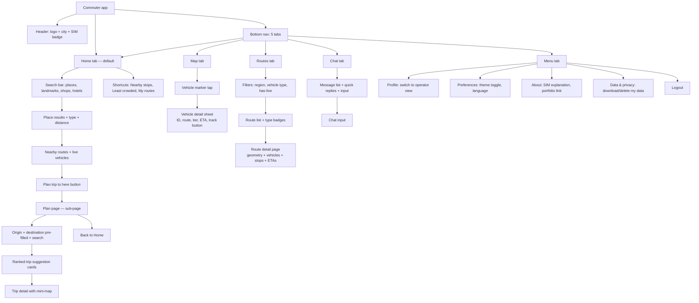
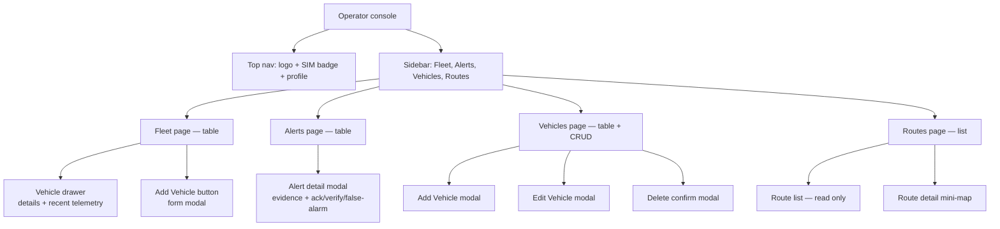

# 07 — UI/UX Design

> Where each feature lives in the UI. Mobile-first commuter app (the showcase); minimal
> functional operator console. Mermaid navigation flowcharts.

---

## Table of contents

1. [Design philosophy](#1-design-philosophy)
2. [Color system (the tier palette)](#2-color-system-the-tier-palette)
3. [Commuter app layout](#3-commuter-app-layout)
4. [Operator console layout (minimal)](#4-operator-console-layout-minimal)
5. [Where each feature lives](#5-where-each-feature-lives)
6. [Mobile responsiveness](#6-mobile-responsiveness)
7. [Dark mode](#7-dark-mode)
8. [Accessibility basics](#8-accessibility-basics)
9. [Commuter navigation flowchart](#9-commuter-navigation-flowchart)
10. [Operator navigation flowchart](#10-operator-navigation-flowchart)

---

## 1. Design philosophy

- **Mobile-first.** Designed for a phone in hand, walking to a jeepney stop. Then enhanced
  for desktop.
- **Thumb-friendly.** Bottom nav, 44px touch targets, key actions reachable with one thumb.
- **Honest.** A "SIM" badge is visible on the map and in the header — the data is simulated.
- **Polished where it matters.** The map, chatbot, trip planner — these should look great.
  The operator console should be clean and functional, not beautiful.
- **Calm.** No unnecessary animations. Smooth transitions where they help (marker movement,
  sheet slide-up). Respect `prefers-reduced-motion`.

---

## 2. Color system (the tier palette)

The four-tier occupancy state is the primary semantic palette. Get these right — they're the
core visual language.

| Tier | Color | Hex | Meaning |
|---|---|---|---|
| Available | Green | `#16a34a` | Plenty of room |
| Filling | Yellow/Amber | `#eab308` | Getting full |
| At capacity | Red | `#dc2626` | Full |
| Overloaded | Blinking red | `#dc2626` (blink) | Over capacity — illegal |

**Brand colors** (NOT indigo/blue per project rules):
- Primary: teal `#0d9488`
- Background: white / slate-950 (dark mode)
- Text: slate-900 / slate-100
- Muted: slate-500

**Dark mode**: swap background/text; tier colors stay the same (they're semantic).

---

## 3. Commuter app layout

The showcase. Mobile-first with a **5-tab bottom navigation**: Home, Map, Routes, Chat, Menu.

```
┌─────────────────────────────┐
│ Header                      │
│ [logo]  Cebu  [SIM]         │  ← logo, city selector, SIM badge
├─────────────────────────────┤
│                             │
│    (tab content —           │  ← Home / Map / Routes / Chat / Menu
│     changes per tab)        │
│                             │
│                       [⊙]  │  ← "locate me" FAB (Map tab only)
│                             │
├─────────────────────────────┤
│ [🏠 Home] [🗺️ Map] [🚌 Routes] [💬 Chat] [☰ Menu] │  ← 5-tab bottom nav
└─────────────────────────────┘
```

### Home tab (default, `/`) — feature C-00 ★ NEW

A **search-first discovery** screen. This is the landing page — the commuter opens the app
here and can immediately search for where they want to go.

- **Search bar** at the top (debounced 300ms) → searches places (landmarks, shops, hotels,
  terminals, streets).
- **Search results**: each place shows name, type icon (landmark/shop/hotel/terminal),
  distance from user (if geolocation available).
- **Tap a place** → expands to show:
  - Nearby routes (routes within 500m of the place).
  - Live vehicles on those routes (with tier pills).
  - **"Plan trip to here" button** → jumps to Plan tab with the place pre-filled as
    destination.
- **Below the search**: quick shortcut cards:
  - "Nearby stops" → Map tab centered on user.
  - "Least crowded now" → Chat tab with that query pre-sent.
  - "My routes" → Routes tab (filtered to saved routes, if any).
- **SIM badge** reminder: "Data is simulated for demo purposes."

### Map tab (`/map`) — feature C-01

The showcase screen. Full-screen interactive map with customizable themes, direction-aware
markers, route polylines, and a 4-tier legend.

- **Full-screen Leaflet map** (react-leaflet) with **5 user-selectable tile themes** (see
  [`05-tech-stack.md §6`](./05-tech-stack.md#6-map)):
  - OSM Standard, CartoDB Light, CartoDB Dark Matter, CyclOSM, Esri Satellite.
  - **Theme switcher button** (layer-stack icon, bottom-right above the locate FAB): opens a
    popover with 5 theme thumbnails. Tap to switch. Selection persists in localStorage.
  - Auto-switches to CartoDB Dark Matter when the app is in dark mode (unless the user has
    manually chosen a theme).
- **Vehicle markers**: custom `divIcon` — a colored circle (tier color) with the route code
  inside + a **direction arrow** (▲ forward / ▼ backward) showing travel direction. For
  `loop` routes, always ▲. Clustering when zoomed out.
  - The original only had 3 tiers (Seats/Standing/Full); this project uses the full 4-tier
    palette (Available/Filling/At capacity/Overloaded-blink).
- **4-tier occupancy legend** (bottom-left of the map): green (Available), amber (Filling),
  red (At capacity), blinking-red (Overloaded). Always visible so commuters learn the colors.
- **Route polylines**: when a commuter taps a route (from Routes tab or Home search), its
  polyline renders as a teal line with stop markers (small dots). The original had no visible
  route lines.
- **Tap a marker** → bottom sheet slides up (mobile) / side panel (desktop):
  - Vehicle ID, route code + name, vehicle type, current tier (colored pill), direction
    (forward/backward), ETA to next 3 stops (direction-aware), last updated.
  - "Track this vehicle" button (highlights + follows the marker).
- **"Locate me" FAB** (bottom-right): requests geolocation, centers map.
- **Right-side control stack** (above the theme switcher): zoom +/-, locate, theme — matches
  the original's right-side control pattern but better organized.
- **SIM badge** in the header (always visible): amber pill "SIM" with tooltip.

**What improves on the original's map (from the screenshots):**
- The original's map had no visible vehicle markers or route lines in the screenshot — just a
  bare map with a legend. This project makes markers + polylines the visual focus.
- The original's 3-tier legend (green/brown/red) is upgraded to 4-tier (green/amber/red/
  blink-red), adding the critical "overloaded" state.
- The original's layer icon was hidden/small; this project makes the theme switcher a
  prominent popover with 5 free themes.
- Direction arrows are new — the original had no way to tell which way a jeepney was heading.

### Routes tab (`/routes`) — feature C-05

- **Search bar** at the top (debounced, filters by route code or name).
- **Filter chips**: "All", "Has live vehicles", **+ filter by region** (e.g., "Cebu City"),
  **+ filter by vehicle type** (e.g., "Jeepney", "Minibus", "Bus") — uses
  `Route.allowedVehicleTypes`.
- **Route list**: cards showing route code, name, region, **vehicle type badges** (the
  `allowedVehicleTypes`), live vehicle count, tier dot.
- **Tap a route** → route detail page (`/routes/:id`):
  - Map with the route geometry (polyline) + live vehicles on it.
  - Stop list with ETAs for the nearest live vehicle.

### Chat tab (`/chat`) — feature C-03

- **Message list** (scrollable, newest at bottom).
- **Quick-reply chips** above the input: "Least crowded now?", "When is next 04L?", "How full
  is the 17C?".
- **Input bar** at the bottom with a send button.
- **Typing indicator** (three dots) while the bot "thinks".
- **Bot messages** cite the route code and vehicle ID they reference — grounded, no
  hallucination.
- **SIM badge** reminder at the top: "Answers are based on simulated data."

### Plan tab (`/plan`) — feature C-04

Launched from the Home tab ("Plan trip to here") or directly from the bottom nav... wait —
Plan is NOT a bottom-nav tab in the 5-tab layout. It's a **page** reached from the Home tab's
search results. The 5 tabs are Home, Map, Routes, Chat, Menu. Plan is a sub-page accessible
via a button on the Home tab (or via a header link on desktop).

- **Origin input** (place search combobox) + "use my location" button.
- **Destination input** (place search combobox) — pre-filled if launched from Home search.
- **Search button**.
- **Results**: ranked cards, each showing:
  - Total time, walking distance.
  - Legs: walk → board (route code, occupancy pill, ETA) → alight → walk.
  - Tap a result → detail view with a mini-map.
- **Back button** → returns to Home (or wherever the user came from).

### Menu tab (`/menu`) — feature C-09 ★ NEW

The 5th bottom-nav tab. Centralizes profile, preferences, and about.

- **Profile section**: avatar/name, email (if auth), "Switch to operator view" (demo toggle).
- **Preferences section**: theme toggle (light/dark/system), language (English only for now).
- **About section**: what Re-LoadSense is, the SIM data explanation, link to the portfolio
  writeup.
- **Data & privacy section**: "Download my data" + "Delete my account" (if auth); explanation
  of what data is collected.
- **Logout** (if auth).

---

## 4. Operator console layout (minimal)

Functional and clean. Don't over-invest here.

```
┌──────────────────────────────────────────────────┐
│ Top nav: [logo] Re-LoadSense Operator  [SIM] [☰] │
├──────────┬───────────────────────────────────────┤
│ Sidebar  │ Main content                          │
│          │                                       │
│ Fleet    │  Fleet table                          │
│ Alerts   │  ┌─────────────────────────────────┐  │
│ Vehicles │  │ ID  Route  Tier  Speed  Updated │  │
│ Routes   │  │ ...                             │  │
│          │  └─────────────────────────────────┘  │
│          │                                       │
└──────────┴───────────────────────────────────────┘
```

### Fleet page (`/operator`, default) — feature O-01

- **Table**: Vehicle ID, Plate, Route, Tier (colored pill), Speed, Last seen, Status.
- **Filter bar**: by route, by tier, by status (online/offline).
- **Row click** → vehicle drawer (right side): details + recent telemetry + bound route.
- **Live updates** via socket.io (rows update in place).

### Alerts page (`/operator/alerts`) — feature O-02

- **Table**: Type, Severity, Vehicle, Route, Raised, Status.
- **Filter**: by status (open/acknowledged/verified/false-alarm), by type.
- **Row click** → alert detail modal:
  - Evidence (telemetry snapshot: location, speed, tier, occupancy, timestamp).
  - Action buttons: Acknowledge, Verify (real), False alarm.
  - Status updates live (socket.io pushes new alerts).

### Vehicles page (`/operator/vehicles`) — feature O-03

- Same table as Fleet but with edit/delete actions.
- "Add Vehicle" button → **sequenced form modal** (see below).
- Edit → pre-filled form modal (all fields editable except vehicleCode).
- Delete → confirm modal (soft delete — `status = 'inactive'`).

#### The sequenced "Add Vehicle" form

The form has **3 steps** that unlock sequentially. This prevents invalid route+type
combinations (a bus on a jeepney-only route, etc.). See
[`03-data-model.md §4`](./03-data-model.md#4-vehicle-types-and-the-route-vehicle-type-constraint).

```
┌─────────────────────────────────────┐
│ Add Vehicle                         │
├─────────────────────────────────────┤
│                                     │
│ Step 1 — Route *                    │
│ ┌─────────────────────────────────┐ │
│ │ Select a route...         ▼     │ │  ← enabled
│ └─────────────────────────────────┘ │
│                                     │
│ Step 2 — Vehicle type *             │
│ ┌─────────────────────────────────┐ │
│ │ (select route first)       ▼    │ │  ← DISABLED until route selected
│ └─────────────────────────────────┘ │
│  ↑ shows only the selected route's  │
│    allowedVehicleTypes              │
│                                     │
│ Step 3 — Details                    │
│ Vehicle code:  [____________]       │  ← DISABLED until type selected
│ Plate number:  [____________]       │  ← DISABLED until type selected
│ Capacity:      [__] (default: 20)   │  ← pre-filled from vehicle type
│                                     │
│         [Cancel]  [Add Vehicle]     │  ← disabled until all required
└─────────────────────────────────────┘
```

**Sequence:**
1. **Step 1 (Route)**: the only enabled field. Operator selects a route from a dropdown. The
   route's `allowedVehicleTypes` is loaded.
2. **Step 2 (Vehicle type)**: unlocks. Dropdown shows ONLY the types in the selected route's
   `allowedVehicleTypes`. Selecting a type pre-fills the capacity default (jeepney=20,
   minibus=30, bus=50, uv_express=18).
3. **Step 3 (Details)**: unlocks. Vehicle code, plate number, capacity (pre-filled, editable).
4. **Submit**: validates on client (Zod) + server. If the route's allowed types changed
   between render + submit, server returns 422 and the form re-renders.

**Edit mode**: all fields enabled (except vehicleCode — read-only). Changing the route
re-filters the type dropdown. If the current type isn't allowed on the new route, the type
clears and a warning shows: "Current vehicle type (bus) is not allowed on this route. Select
a valid type."

### Routes page (`/operator/routes`) — feature O-04

- **Read-only list** of routes (code, name, region, **allowed vehicle types**, vehicle count).
- **Filter bar**: by region, by vehicle type (same filters as commuter Routes tab).
- Tap → route detail (geometry on a mini-map, stops list, live vehicles).
- **No add/edit** — keep it minimal.

---

## 5. Where each feature lives

### Commuter app

| Feature | Where it lives |
|---|---|
| Home search (C-00) | Home tab (search bar + results + shortcuts) |
| Live map with markers (C-01) | Map tab (full screen) |
| Vehicle detail (C-01) | Bottom sheet (mobile) / side panel (desktop) on marker tap |
| ETA display (C-02) | In the vehicle detail sheet + route detail stops list |
| Route directory + filtering (C-05) | Routes tab (search + filters + list) |
| Route detail (C-05) | `/routes/:id` page |
| Chatbot (C-03) | Chat tab (full screen) |
| Trip planner (C-04) | `/plan` page (launched from Home "Plan trip to here") |
| Place search (C-06) | Home tab search + Plan tab inputs |
| Dark mode (C-07) | Menu tab → preferences → theme toggle |
| Menu / profile / about (C-09) | Menu tab (5th bottom-nav tab) |
| SIM badge (X-01) | Header (always visible) |

### Operator console

| Feature | Where it lives |
|---|---|
| Fleet list (O-01) | Fleet page (table) |
| Vehicle detail (O-01) | Right drawer on row click |
| Alerts list (O-02) | Alerts page (table) |
| Alert verification (O-02) | Modal on row click (ack/verify/false-alarm buttons) |
| Vehicle CRUD (O-03) | Vehicles page (table + add/edit/delete modals) |
| Route list (O-04) | Routes page (read-only) |

---

## 6. Mobile responsiveness

| Breakpoint | Width | Behavior |
|---|---|---|
| `sm` | 640px | Phones — bottom nav, full-screen map, bottom sheets |
| `md` | 768px | Tablets — bottom nav, map + side list |
| `lg` | 1024px | Small desktop — operator sidebar appears |
| `xl` | 1280px | Desktop — full layouts |

**Commuter app**: always bottom nav (even on desktop — it's mobile-first). On desktop, the
map gets wider and the route list becomes a side panel.

**Operator console**: sidebar collapses to a hamburger below `lg`. Tables get horizontal
scroll on narrow screens.

**Touch targets**: minimum 44×44px for all interactive elements.

---

## 7. Dark mode

- `next-themes` with `attribute="class"`.
- Three options: Light, Dark, System (default).
- Toggle in the profile menu.
- Full token swap: background, text, borders, cards all change. Tier colors stay the same.
- Map tiles: CartoDB dark matter in dark mode, OSM standard in light mode.

---

## 8. Accessibility basics

Not aiming for full WCAG AA (production scope), but hitting the basics:

- **Semantic HTML**: `<main>`, `<nav>`, `<header>`, `<section>`.
- **Alt text** on images.
- **Labels** on form inputs.
- **Keyboard nav**: tabs and buttons are focusable; modals trap focus; ESC closes.
- **ARIA live region** on the chatbot message list (announces new messages).
- **`prefers-reduced-motion`**: the "blinking red" overloaded marker becomes steady red.
- **Color is not the only indicator**: tier pills have text labels alongside the color.
- **Skip-to-content** link (visually hidden, focusable).

Manual screen-reader check once at the end.

---

## 9. Commuter navigation flowchart



---

## 10. Operator navigation flowchart



---

## Next

- [`08-implementation-checklist.md`](./08-implementation-checklist.md) — the ordered build steps
